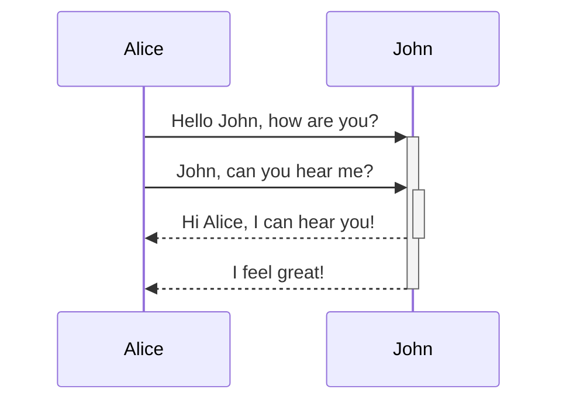

## Mermaid, Drawing Diagrams with Code

[Mermaid](https://mermaid.js.org/) is a tool for diagrams and charts.
It's a tool that allows you to create various diagrams with simple text, just like Markdown.

You can try it out in the officially provided [live editor](https://mermaid.live/edit#pako:eNpVjsFugkAQhl9lM6c2QYMKuuyhSYXWi0mb1FPBwwRWlii7ZFliKfDuXTA17Zxm8n3_n-kgVRkHBqeLuqYCtSGHKJHEznMcCl3UpsT6SGazp37HDSmV5G1Ptg87RWqhqqqQ-ePN344SCbv9qHFiRCHPww2FU_5N8p5E8R4ro6rjX3K4qp68xMW7sPX_idDcpl7jE7ITzlLUJEQ9KeBArosMmNENd6DkusTxhG6kCRjBS54As2uG-pxAIgebqVB-KlX-xrRqcgG2-1Lbq6kyNDwqMNd4V7Ax6qOV6T3CZcZ1qBppgPlTI7AOvoCtgvmCbjy69L1VsFpTz4EWGHXnlAbB0l-4GzdYu3Rw4Ht6wYKNP_wAsr14cw).

## Where do I use this?

That was the first thought I had when I learned about Mermaid.

I knew about Mermaid's existence, but
I couldn't find a _reason to learn the syntax_.

'Can't I just draw it with a diagram tool?'
That was my thought.

I didn't have many occasions to draw diagrams at work,
and there were many GUI tools that could easily draw diagrams.

## Text-Based Tools

But let's think about it.

Mermaid is a tool that draws 'diagrams' with 'text'.
And the AI we use every day is very good at handling 'text'.

Try asking AI for an explanation and say, 'Summarize it with Mermaid'.
A diagram for understanding will pop out.

It's easy to see and understand at a glance.

## Where can I use it?

### Learning

It helps to draw the 'big picture' when studying alone.

When you focus on individual concepts or details,
it's easy to lose sight of the overall structure.

In that case, you can ask Mermaid for the big picture.

For example, let's say you studied the flow of an HTTP request.
You learn various concepts separately, such as what DNS does, and what goes on between the client and server.

But at the end, if you ask GPT to "Summarize it with Mermaid",
you can grasp the complex concepts at a glance with a single picture.

You can experience the scattered concepts in your head
connecting and being organized.

### Study Summary Materials

Actually, I was inspired to write this post after seeing [@joje0311](https://www.threads.com/@joje0311) use it in a React study.

In the study, they used Mermaid to summarize what they had studied.

I was surprised at how neatly it was organized.

Moreover, [Github supports Mermaid's Markdown syntax.](https://docs.github.com/ko/get-started/writing-on-github/working-with-advanced-formatting/creating-diagrams)
Thanks to this, you can see the diagram if you organize it in a .md file.

Try using it in your README.md.

### Collaboration

You can also use it usefully for collaboration.

If you have a complex API,
it's difficult to remember how it works one by one.

In that case, you can ask Cursor to
share it as a diagram.

It's easier to remember later and much easier for team members to see
what features work and how.

It can also be useful for onboarding new team members.

## Try it out

Is there anything you are studying right now?
Or is there any code you wrote today?

> **"Summarize what I just studied into a diagram with Mermaid."**

Or

> **"Visualize the flow of this code with Mermaid."**

Try asking!

And try moving it to Obsidian, or the [live editor](https://mermaid.live/edit#pako:eNpVjsFugkAQhl9lM6c2QYMKuuyhSYXWi0mb1FPBwwRWlii7ZFliKfDuXTA17Zxm8n3_n-kgVRkHBqeLuqYCtSGHKJHEznMcCl3UpsT6SGazp37HDSmV5G1Ptg87RWqhqqqQ-ePN344SCbv9qHFiRCHPww2FU_5N8p5E8R4ro6rjX3K4qp68xMW7sPX_idDcpl7jE7ITzlLUJEQ9KeBArosMmNENd6DkusTxhG6kCRjBS54As2uG-pxAIgebqVB-KlX-xrRqcgG2-1Lbq6kyNDwqMNd4V7Ax6qOV6T3CZcZ1qBppgPlTI7AOvoCtgvmCbjy69L1VsFpTz4EWGHXnlAbB0l-4GzdYu3Rw4Ht6wYKNP_wAsr14cw).

If you try it yourself,
you will definitely have a moment where you feel, "Oh? This is pretty good...?"

If you really have nothing to try,
copy this blog post and ask GPT to summarize it!

Reading about it and experiencing it yourself are different.
