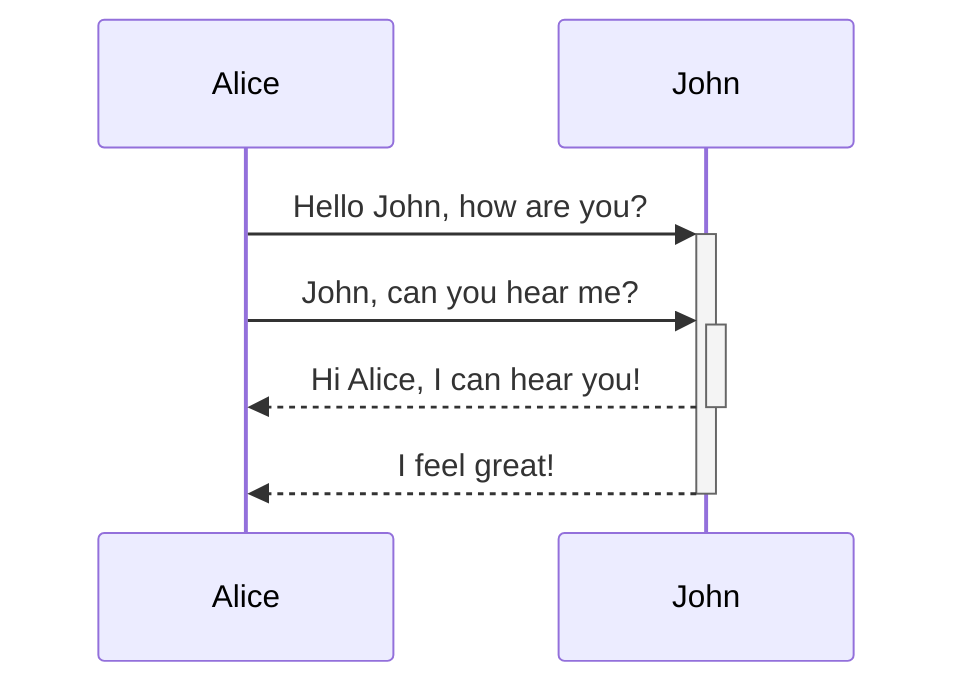

## Mermaid、コードでダイアグラムを描く

[Mermaid（マーメイド）](https://mermaid.js.org/)は、ダイアグラムやチャートを作成するためのツールです。
マークダウンのように簡単なテキストだけで、さまざまなダイアグラムを作成できるツールです。

公式が提供する[ライブエディタ](https://mermaid.live/edit#pako:eNpVjsFugkAQhl9lM6c2QYMKuuyhSYXWi0mb1FPBwwRWlii7ZFliKfDuXTA17Zxm8n3_n-kgVRkHBqeLuqYCtSGHKJHEznMcCl3UpsT6SGazp37HDSmV5G1Ptg87RWqhqqqQ-ePN344SCbv9qHFiRCHPww2FU_5N8p5E8R4ro6rjX3K4qp68xMW7sPX_idDcpl7jE7ITzlLUJEQ9KeBArosMmNENd6DkusTxhG6kCRjBS54As2uG-pxAIgebqVB-KlX-xrRqcgG2-1Lbq6kyNDwqMNd4V7Ax6qOV6T3CZcZ1qBppgPlTI7AOvoCtgvmCbjy69L1VsFpTz4EWGHXnlAbB0l-4GzdYu3Rw4Ht6wYKNP_wAsr14cw)で試すことができます。

## これをどこで使うの？

マーメイドを知って最初に思ったことです。

マーメイドの存在は知っていましたが、
*文法を学ぶ理由*を見つけられませんでした。

「普通にダイアグラムツールで描けばいいんじゃない？」
そう思っていました。

仕事でダイアグラムを描くこともあまりなく、
ダイアグラムを簡単に描けるGUIツールも多かったからです。

## テキストベースのツール

しかし、考えてみてください。

マーメイドは「テキスト」で「ダイアグラム」を描くツールです。
そして、私たちが毎日使っているAIは「テキスト」を非常にうまく扱います。

AIに説明を求め、「Mermaidでまとめて」と言ってみてください。
理解のためのダイアグラムがさっと出てきます。

一目で整理でき、理解しやすいです。

## どこで使えるか？

### 学習

一人で勉強するとき、「全体像」を把握するのに役立ちます。

個々の概念や詳細に集中していると、
全体的な構造を見失いがちです。

そんな時、Mermaidに全体像をお願いすることができます。

例えば、HTTPリクエストの流れを勉強したとしましょう。
DNSが何をするのか、クライアントとサーバーの間で何が起こるのかなど、
さまざまな概念を別々に学習します。

しかし、最後にGPTに「Mermaidでまとめて」と頼むと、
複雑だった概念を一つの図で一目で把握できます。

頭の中で散らばっていた概念が
つながり、整理される経験ができます。

### 勉強会の要約資料

実はこの記事は、[@joje0311](https://www.threads.com/@joje0311)さんがReactの勉強会で使っているのを見て、
インスピレーションを得て書きました。

勉強会でMermaidを使って、
自分が勉強した内容をまとめていました。

きれいにまとめられているのを見て、びっくりしました。

さらに、[GithubはMermaidのマークダウン構文をサポートしています。](https://docs.github.com/ko/get-started/writing-on-github/working-with-advanced-formatting/creating-diagrams)
おかげで、.mdファイルでまとめればダイアグラムを見ることができます。

README.mdに活用してみてください。

### 協業

協業にも役立ちます。

複雑なAPIがある場合、
その動作を一つ一つ覚えるのは難しいです。

そんな時、Cursorに頼んで
ダイアグラムで共有すればいいのです。

後で思い出しやすく、チームメンバーがどの機能がどのように動作するのか
ずっと分かりやすくなります。

また、新しいチームメンバーのオンボーディングにも役立ちます。

## 使ってみる

今、何か勉強していることはありますか？
それとも、今日書いたコードはありますか？

> **「さっき勉強した内容をMermaidでダイアグラムにまとめて。」**

あるいは

> **「このコードの流れをMermaidで視覚化して。」**

と頼んでみてください！

そして、Obsidianや[ライブエディタ](https://mermaid.live/edit#pako:eNpVjsFugkAQhl9lM6c2QYMKuuyhSYXWi0mb1FPBwwRWlii7ZFliKfDuXTA17Zxm8n3_n-kgVRkHBqeLuqYCtSGHKJHEznMcCl3UpsT6SGazp37HDSmV5G1Ptg87RWqhqqqQ-ePN344SCbv9qHFiRCHPww2FU_5N8p5E8R4ro6rjX3K4qp68xMW7sPX_idDcpl7jE7ITzlLUJEQ9KeBArosMmNENd6DkusTxhG6kCRjBS54As2uG-pxAIgebqVB-KlX-xrRqcgG2-1Lbq6kyNDwqMNd4V7Ax6qOV6T3CZcZ1qBppgPlTI7AOvoCtgvmCbjy69L1VsFpTz4EWGHXnlAbB0l-4GzdYu3Rw4Ht6wYKNP_wAsr14cw)に書き写してみてください。

自分で試してみると、
「お？これ、かなりいいな…？」と感じる瞬間がきっと来るはずです！

本当に試すことがなければ、
このブログ記事をコピーしてGPTにまとめてもらうのもいいでしょう！

文章で読むのと、実際にやってみるのとでは経験が違います。
