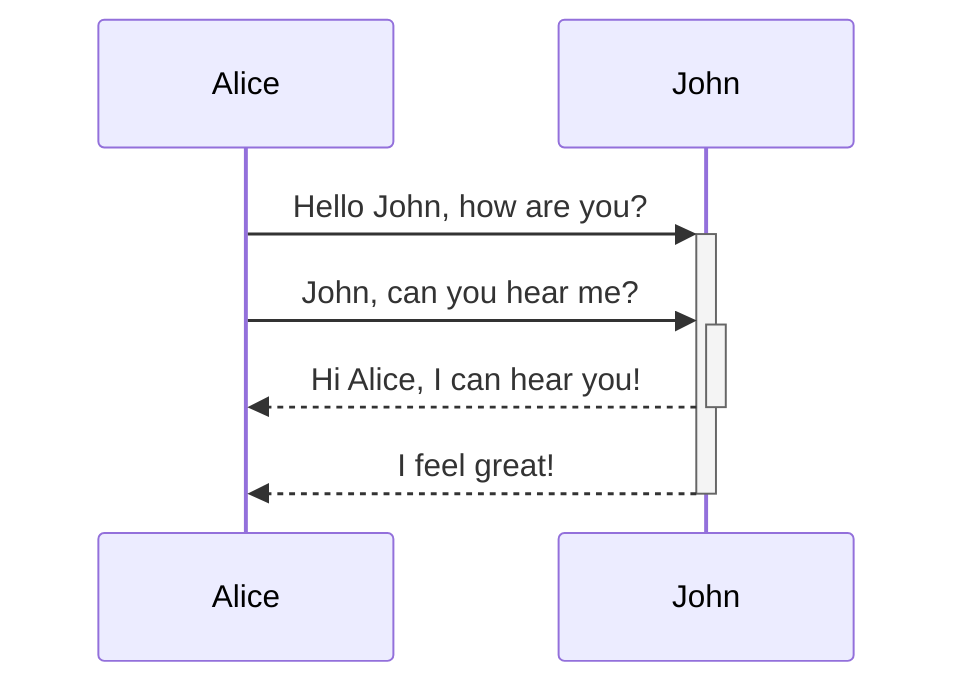

## Mermaid, 코드로 다이어그램 그리기

[Mermaid(머메이드)](https://mermaid.js.org/)는 다이어그램 및 차트를 위한 도구입니다.
마크다운처럼 간단한 텍스트만으로 다양한 다이어그램을 만들 수 있는 도구이죠.

공식으로 제공하는 [라이브 에디터](https://mermaid.live/edit#pako:eNpVjsFugkAQhl9lM6c2QYMKuuyhSYXWi0mb1FPBwwRWlii7ZFliKfDuXTA17Zxm8n3_n-kgVRkHBqeLuqYCtSGHKJHEznMcCl3UpsT6SGazp37HDSmV5G1Ptg87RWqhqqqQ-ePN344SCbv9qHFiRCHPww2FU_5N8p5E8R4ro6rjX3K4qp68xMW7sPX_idDcpl7jE7ITzlLUJEQ9KeBArosMmNENd6DkusTxhG6kCRjBS54As2uG-pxAIgebqVB-KlX-xrRqcgG2-1Lbq6kyNDwqMNd4V7Ax6qOV6T3CZcZ1qBppgPlTI7AOvoCtgvmCbjy69L1VsFpTz4EWGHXnlAbB0l-4GzdYu3Rw4Ht6wYKNP_wAsr14cw)에서 사용해볼 수 있습니다.

## 이걸 어디에 써?

머메이드를 알고 가장 처음 들었던 생각입니다.

머메이드의 존재는 알고있었지만,
*문법을 배울 이유*를 찾지 못했습니다.

'그냥 다이어그램 툴로 그리면 되지 않나?'
이런 생각이었죠.

일하면서 다이어그램을 그릴 일도 많이 없었고,
다이어그램을 쉽게 그릴 수 있는 GUI 툴도 많았기 때문이죠.

## 텍스트 베이스의 도구

그런데 생각해보죠.

머메이드는 '텍스트'로 '다이어그램'을 그려주는 도구입니다.
그리고 우리가 매일 사용하는 AI는 '텍스트'를 굉장히 잘 다룹니다.

AI에게 설명을 요청하고, 'Mermaid로 정리해줘'라고 해보세요.
이해를 위한 다이어그램이 뚝딱 나오게됩니다.

한 눈에 정리하고, 이해하기 쉽죠.

## 어디에 사용할 수 있을까?

### 학습

혼자 공부할 때 '큰 그림'을 그리는 데 도움이 됩니다.

개별 개념이나 세부 사항에 집중하다 보면,
전체적인 구조를 놓치기 쉽죠.

그럴 때 Mermaid로 큰 그림을 부탁할 수 있습니다.

예를들어, HTTP 요청의 흐름을 공부했다고 생각해보죠.
DNS가 뭘 하는지, 클라이언트와 서버 사이에 어떤 일이 오가는지 등
여러 개념을 따로따로 학습합니다.

하지만 마지막에 GPT에게 "Mermaid로 정리해줘" 요청하면,
복잡했던 개념들을 하나의 그림으로 한 눈에 파악할 수 있습니다.

머릿속에서 흩어졌던 개념들이
연결되며 정리되는 경험을 할 수 있죠.

### 스터디 요약 자료

사실 이 글은 [@joje0311](https://www.threads.com/@joje0311) 님이 리액트 스터디에서 사용하신걸 보고,
영감을 받아 작성했습니다.

스터디에서 Mermaid를 사용하여,
본인이 공부한 내용을 정리하셨는데요.

깔끔하게 정리된 모습에 깜짝 놀랐습니다.

게다가 Github는 Mermaid의 마크다운 문법을 지원합니다.
덕분에 .md 파일로 정리하면 다이어그램을 볼 수 있죠.

README.md에 활용해보세요.

### 협업

협업에도 유용하게 사용할 수 있습니다.

복잡한 API가 있는 경우,
그 동작을 하나하나 기억하기 어렵습니다.

그럴 때 Cursor에게 요청해서
다이어그램으로 공유하면 됩니다.

나중에 기억하기도 쉽고 팀원들이 어떤 기능이 어떻게 동작하는 지
알아보기 훨씬 수월하죠.

또, 새로운 팀원의 온보딩에도 유용하게 사용할 수 있습니다.

## 사용해보기

혹시 지금 공부하고 있는게 있을까요?
아니면 오늘 작성한 코드가 있을까요?

> **"방금 공부한 내용을 Mermaid로 다이어그램으로 정리해줘."**

혹은

> **"이 코드의 흐름을 Mermaid로 시각화해줘."**

요청해보세요!

그리고 Obsidian, 혹은 [라이브 에디터](https://mermaid.live/edit#pako:eNpVjsFugkAQhl9lM6c2QYMKuuyhSYXWi0mb1FPBwwRWlii7ZFliKfDuXTA17Zxm8n3_n-kgVRkHBqeLuqYCtSGHKJHEznMcCl3UpsT6SGazp37HDSmV5G1Ptg87RWqhqqqQ-ePN344SCbv9qHFiRCHPww2FU_5N8p5E8R4ro6rjX3K4qp68xMW7sPX_idDcpl7jE7ITzlLUJEQ9KeBArosMmNENd6DkusTxhG6kCRjBS54As2uG-pxAIgebqVB-KlX-xrRqcgG2-1Lbq6kyNDwqMNd4V7Ax6qOV6T3CZcZ1qBppgPlTI7AOvoCtgvmCbjy69L1VsFpTz4EWGHXnlAbB0l-4GzdYu3Rw4Ht6wYKNP_wAsr14cw)에 옮겨 적어보세요.

직접 시도해보면
"어? 이거 꽤 좋네...?" 느끼는 순간이 분명 올 겁니다!

정말 시도해볼게 없다면,
이 블로그 글을 복사해서 GPT에게 정리해달라고 해보세요!

글로 읽는 것과, 직접 해보는 경험은 다릅니다.
